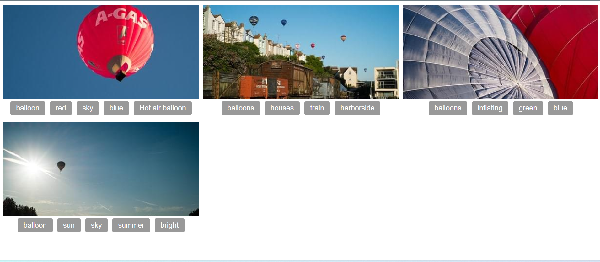
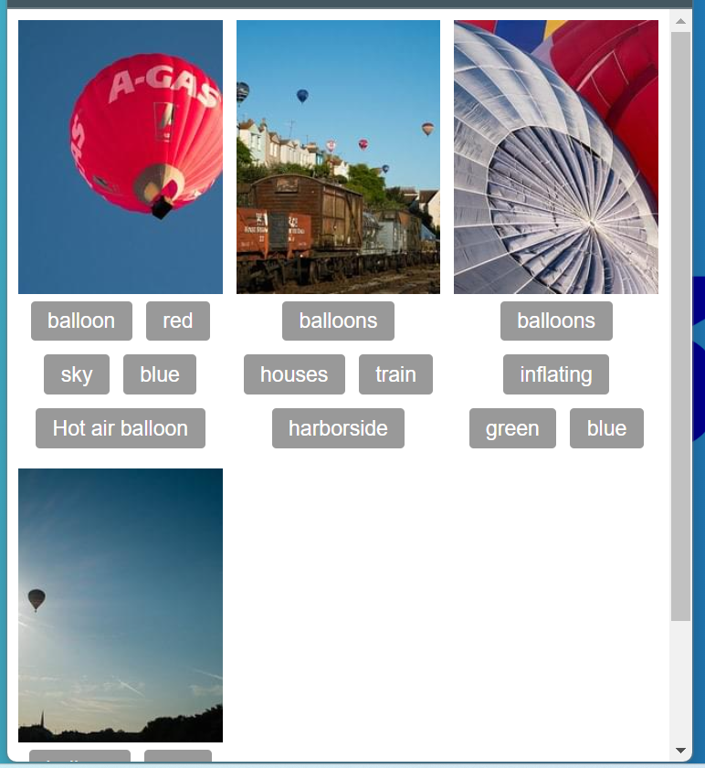

# Reto2.11

Nombre y Apellidos: Pablo Rodríguez Crespo
URL del repositorio de gitlab: https://github.com/Pablosax9/ODAW2_RETO.2.11_flexgrid_1.git

## Enunciado

Replica el ejemplo que te muestro a continuación:
1. Utiliza Grid y Flex CSS.
2. El espacio entre cuadriculas es de 10px.
3. No es necesario realizar ningún cambio en el html.  
Imagen1.

Imagen2.  
